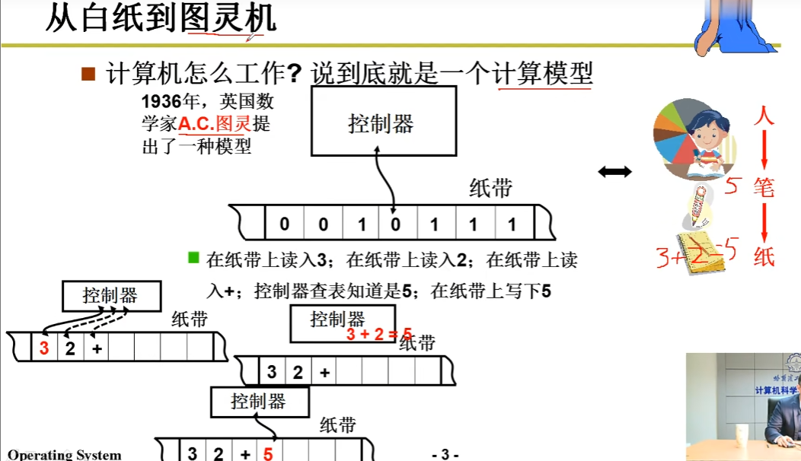
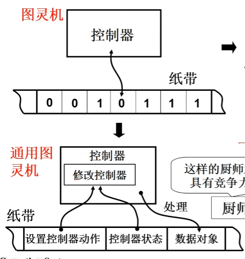
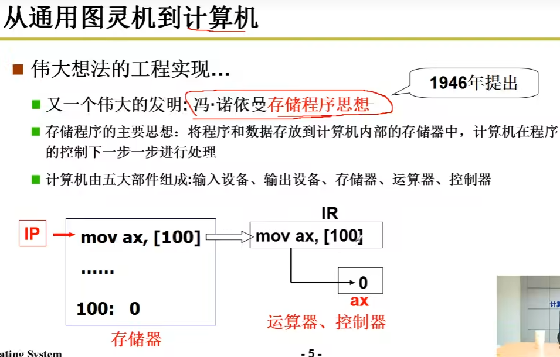
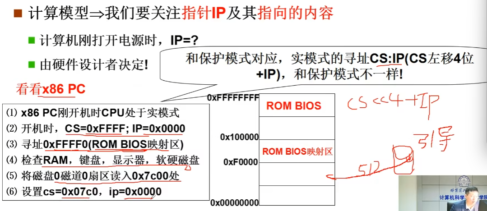
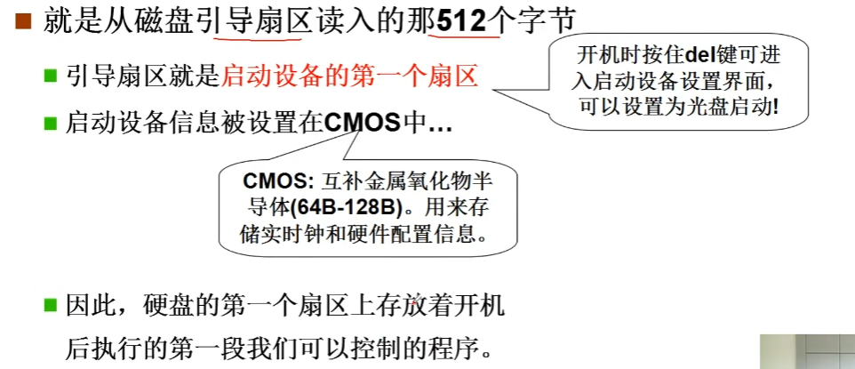
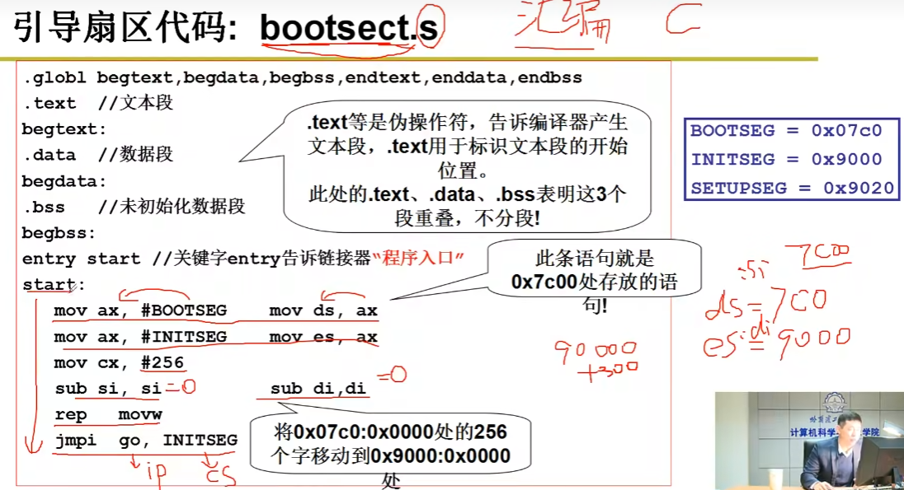
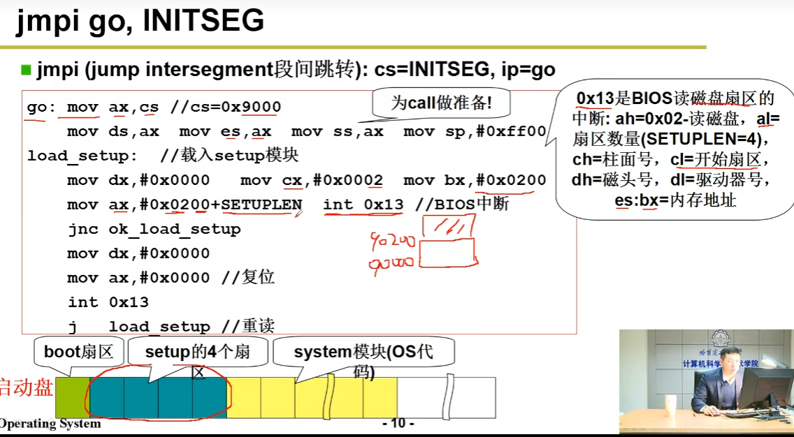
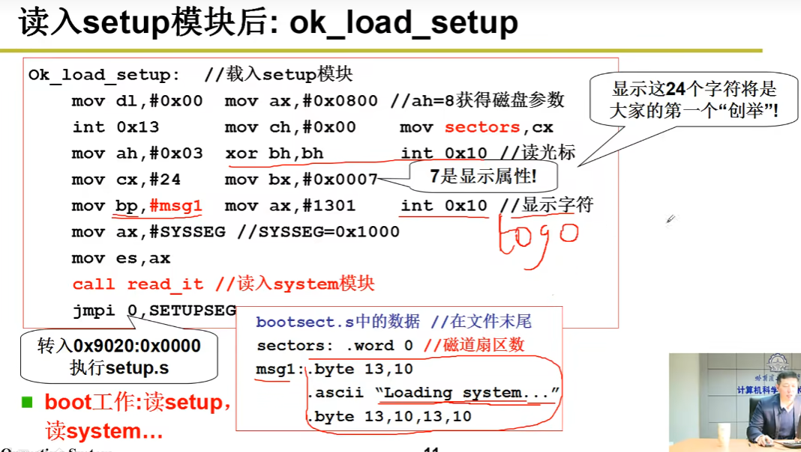
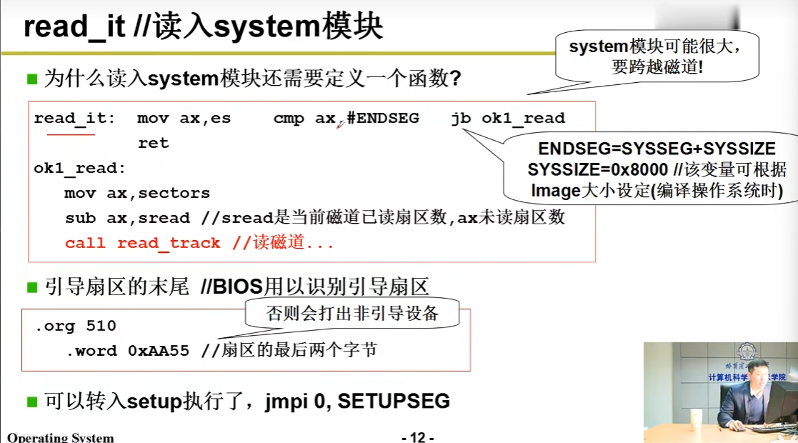

# 操作系统(其二)

## 计算机是怎么工作

1.从白纸到图灵机

计算机说到底是一个计算模型

2.从图灵机到通用图灵机

能够设置控制器动作，使计算机不止一种运算方式

3.从通用图灵机到计算机

计算机工作原理：

> 取址执行：把程序放到内存里，用指针指向它，然后取地址执行产生结果

## 开机执行命令

> 1个扇区=512字节

1.在引导进入操作系统之前，开机所做的事

2.进入引导扇区0x7c00后，进入操作系统

通过汇编读取bootsetup内容

最后bootsect所做的事，载入Logo引导程序进入setup阶段