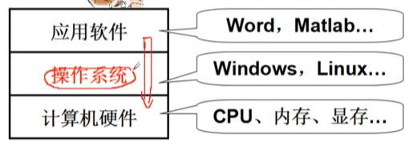
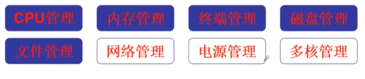

# 操作系统 （其一）

## 1.什么是操作系统

1.只有计算机硬件的被称为裸机

2.是计算机硬件和应用之间的一层软件

### 方便我们使用硬件

### 操作系统管理哪些硬件

### 我们需要学什么内容

#### 1.从应用软件出发到“探到操作系统”

集中在使用计算机的接口上

使用显示器：printf，使用CPU：fork，使用文件：open,read....

#### 2.从应用软件出发“进入操作系统”

一段文字是如何写道磁盘上的

#### 3.从硬件出发“设计并实现操作系统”

给你一个板子，配一个操作系统

#### 4.进入操作系统

能理解真实操作系统的运转

printf("hello")到底是怎么回事

能在真实的基本操作系统上动手实践

#### 本课程如何学操作系统

实验一：扩展线程

实验二：实现系统调用

实验三：实现虚存管理

实验四：扩展文件系统